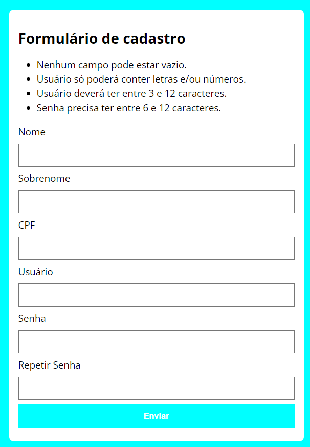

# Valida-FormularioJS

# ✍️ Projeto

Uma atividade desenvolvida com intuito de aprimorar meu conhecimento em javascript. Utilizei nesse projeto somente recursos front-end para validação dos campos que deveriam seguir algumas regras:
<strong>
- Nenhum campo pode estar vazio
- O usuário só poderá conter letras e/ou números
- O usuário deve ter entre 3 e 12 caracteres
- A senha precisa ter entre 6 e 12 caracteres
</strong>

 

# 🛠️Tecnologias utilizadas
  - <h2>HTML</h2>
  - <h2>CSS</h2>
  - <h2>Javascript</h2>
 

# 🖼️ Formulário de Validação

